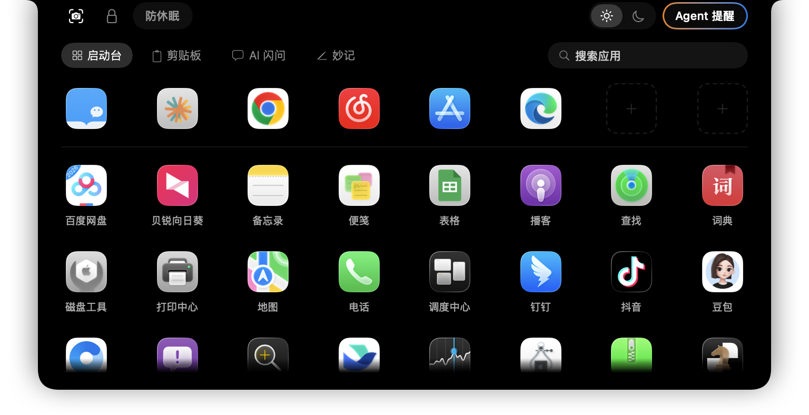
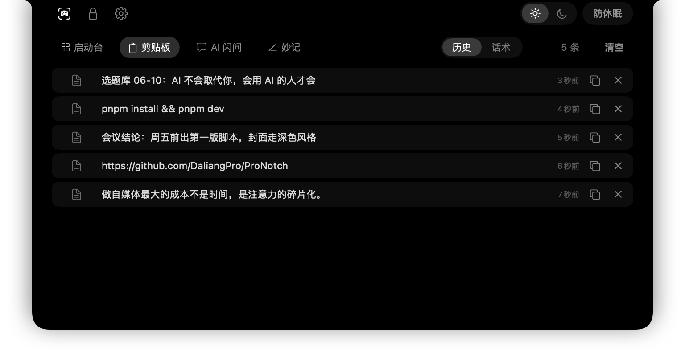
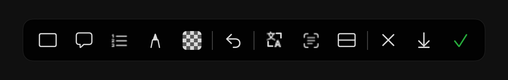
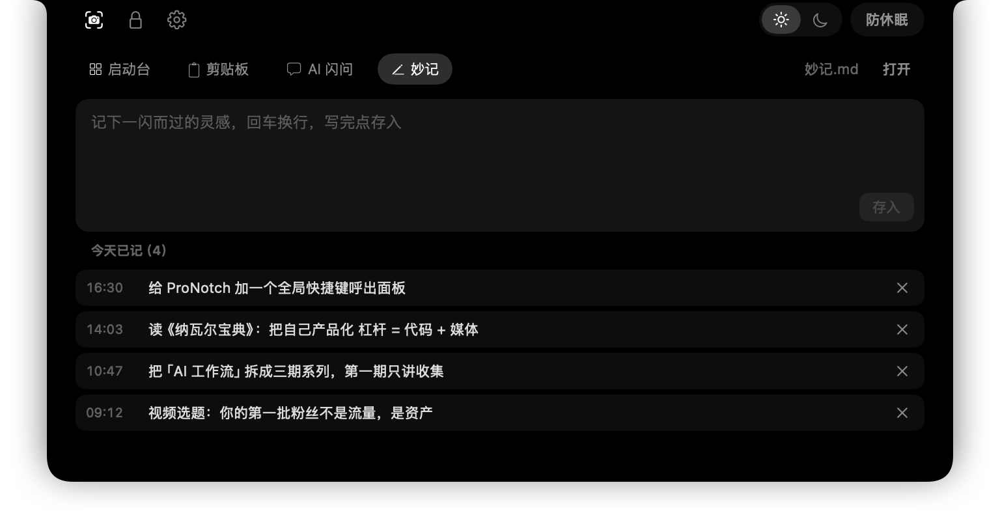
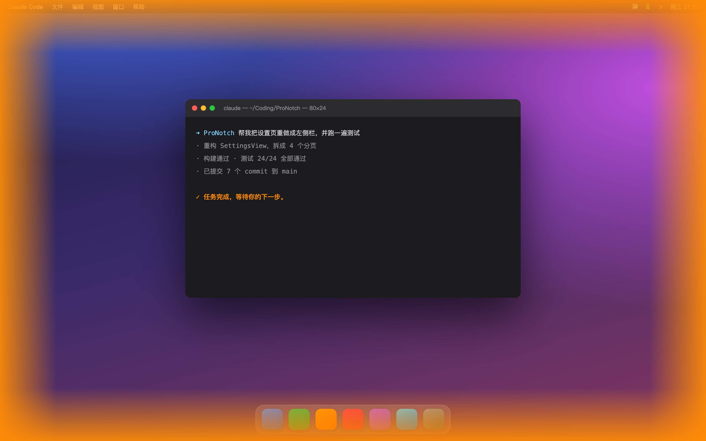

# CY Pro Notch

把 MacBook 的刘海变成你的效率中心：鼠标悬停刘海，自动展开一块面板——App 快捷启动、剪贴板历史、AI 问答、灵感闪记，移开鼠标自动收回，不占 Dock、不抢焦点。

外接显示器作主屏时，面板会出现在主屏顶部中间的「模拟刘海」热区，没有刘海的 Mac 也能用。


## 功能

**启动台** — 全部应用网格 + 即时搜索（回车直接启动第一个结果），常用 App 可右键置顶到顶部专属槽位、置顶图标还能拖动排序：



**剪贴板** — 自动记录文本 / 图片剪贴历史（密码管理器标记的敏感内容自动跳过），鼠标悬停刘海即可浏览、一键复制 / 删除；内置「话术库」，常用回复一键复制。更进一步，**全局快捷键（默认 ⌥⌘V，可自定义）唤出「剪贴板切换器」**：屏幕中央铺开一排横向大卡片，← → 选择、回车把选中项自动粘贴回你刚才的输入框、Esc 取消（鼠标点卡片也行），挑历史项全程不用碰鼠标：




**超级截图** — 全局快捷键（可在设置里自定义）或刘海快捷区一键唤起区域截图，框选后弹出工具栏：

- **框选高亮**：矩形 / 椭圆框，可选实线 / 虚线、颜色、粗细；开「高亮」即聚光灯效果——框内提亮、框外压暗，一眼锁定重点
- **文字备注**：在图上添加带引导线的文字说明
- **步骤序号**：①②③ 流程标号，把操作步骤讲清楚
- **自由画笔**：手绘勾画，颜色 / 粗细可调
- **马赛克遮挡**：涂抹、框选两种方式，盖住敏感信息
- **原位翻译**：把图里的外文译成中文，直接贴回原图位置（接你自己填的翻译接口）
- **提取文字（OCR）**：识别图中文字，可编辑修正、一键复制
- **长截图**：超出一屏的内容自动滚动、逐帧无缝拼接，支持向上 / 向下；过程中鼠标移开即暂停滚动，随时点「停止」收尾
- **撤销** / **复制到剪贴板** / **保存到桌面**



**AI 闪问** — 自填任意 OpenAI 兼容接口（DeepSeek / Kimi / Ollama 等均可），流式输出、Markdown 渲染、可拉取模型列表；联网搜索可选 **DuckDuckGo（免费、零配置）/ Tavily / Brave**，各自填 Key、一键测试：


**妙记** — 灵感随手记，写完点存入即追加到你指定的 Markdown 文件（按天分节、带时间戳），Obsidian 用户可直达 vault 收件箱：



**Agent 提醒**（新）— 让 Claude Code / Codex 这类 Agent 完成任务时，屏幕四周亮起呼吸光晕提醒你：Claude Code 橙色、Codex 蓝色，颜色与呼吸节奏都可调；切回对应窗口即自动熄灭。在设置里给每个 Agent 一个开关就能接入它的「完成」钩子——跑长任务时人离开，也不会错过它干完活：



**还有**：**多显示器全覆盖**（新）——每块屏都有独立刘海面板，外接屏 / 扩展屏也能用，插拔显示器自动增减；菜单栏「检查更新」自动提醒新版本（基于 GitHub Releases，发现新版弹通知 + 菜单标记，引导手动下载）；刘海两侧快捷区（超级截图、熄屏锁定、防休眠、macOS 系统外观深浅色切换、右上角 Agent 提醒开关；应用设置入口在菜单栏图标）；四个标签页和快捷图标都可拖动排序，排第一的标签就是默认页；检测到全屏应用时自动隐藏，不遮挡内容（可在设置关闭）。

## 安装

要求 macOS 14 或更高（Apple Silicon 与 Intel 均支持）。10

1. 从 [Releases](../../releases) 下载最新的 `CY-Pro-Notch-x.y.z.dmg`
2. 打开 DMG，把 CY Pro Notch 拖进「应用程序」
3. **首次打开**：本应用未做 Apple 签名公证（个人开源项目，不想交每年 99 美元），系统会提示无法打开。两种解决办法任选：
   - 在「应用程序」里**右键 CY Pro Notch → 打开 → 再点打开**
   - 或在终端执行：`xattr -dr com.apple.quarantine /Applications/ProNotch.app`
4. 启动后菜单栏出现图标，鼠标移到屏幕顶部中间的刘海位置即可展开面板

### 权限说明

按需触发，不用的功能不需要给权限：

| 权限 | 什么时候要 |
|---|---|
| 屏幕录制 | 第一次用「超级截图」 |
| 辅助功能 | 第一次用「长截图」自动滚动，或「剪贴板切换器」回车自动粘贴 |
| 自动化（System Events） | 第一次用「系统外观深浅色切换」 |
| 登录项 | 在设置里打开「开机自启」 |

## 隐私与安全

- 所有数据只存在你的 Mac 本地，应用本身不上传任何内容
- AI 的 API Key 存放在 macOS 钥匙串，不落明文配置文件
- 联网行为：调用你自己填的 AI 接口、联网搜索（DuckDuckGo / Tavily / Brave，按你所选）；以及启动时向 GitHub 查询一次最新版本号（仅版本号，不含任何个人数据）
- 因为是未签名应用，更新版本后首次读取钥匙串可能弹一次确认框，点「允许」即可

## 从源码构建

要求 Xcode 命令行工具（含 Swift 工具链）。纯 SwiftPM 工程，无 .xcodeproj。

```bash
./Scripts/install.sh            # 构建并安装到 /Applications（旧版进废纸篓）
./Scripts/build-app.sh          # 只构建不安装，产物在 build/ProNotch.app
./Scripts/package-dmg.sh        # 通用二进制（arm64 + x86_64）+ 分发 DMG
```

提示：使用前请先退出 boring.notch 等其他刘海应用，避免抢占刘海区域。

## 开发与调试

调试通道只编译进 debug 构建（`swift build` 默认配置），正式 release 版不含。手动触发展开/收起：

```bash
swift -e 'import Foundation; DistributedNotificationCenter.default().postNotificationName(.init("com.daliangpro.ProNotch.toggle"), object: nil, userInfo: nil, deliverImmediately: true)'
```

其他调试通知名（同样的发送方式）：`snapshot`（面板离屏渲染到 /tmp/notchhub-snapshot.png）、`nexttab`、`testlaunch`、`testpaste`、`testchat`、`testmodels`、`testsearch`、`testcapture`、`snapsettings` 等，详见 `AppDelegate.swift`。

测试隔离：用参数域覆盖配置，不碰真实数据，例如
`.build/debug/ProNotch -captureInboxPath /tmp/test.md -chatBaseURL http://127.0.0.1:8000/v1`。
命令行用 `pbcopy` 测中文需带 `LANG=zh_CN.UTF-8`，否则 C locale 会把中文丢成空。

## 架构要点

- `NotchGeometry`：刘海定位，跟随主屏——有真实刘海贴刘海，否则在菜单栏顶部居中模拟热区
- `NotchPanel`：无边框 NSPanel，层级高于菜单栏、全空间可见、不激活抢焦点
- `NotchViewModel`：展开/收起状态机。窗口 frame 固定为展开尺寸、永不调整（杜绝位置漂移与斜向展开）；收起时 `ignoresMouseEvents = true`，假刘海区域点击穿透到菜单栏；悬停检测 = 全局/本地鼠标监听 + 0.2s 轮询兜底
- 数据层（启动台/剪贴板/话术/对话/妙记/快捷区/设置）全部由 AppDelegate 持有，换屏重建窗口不丢状态
- 全屏检测走空间切换事件驱动（零轮询）；深浅色切换走 System Events 脚本接口

## 许可

[MIT](LICENSE)
